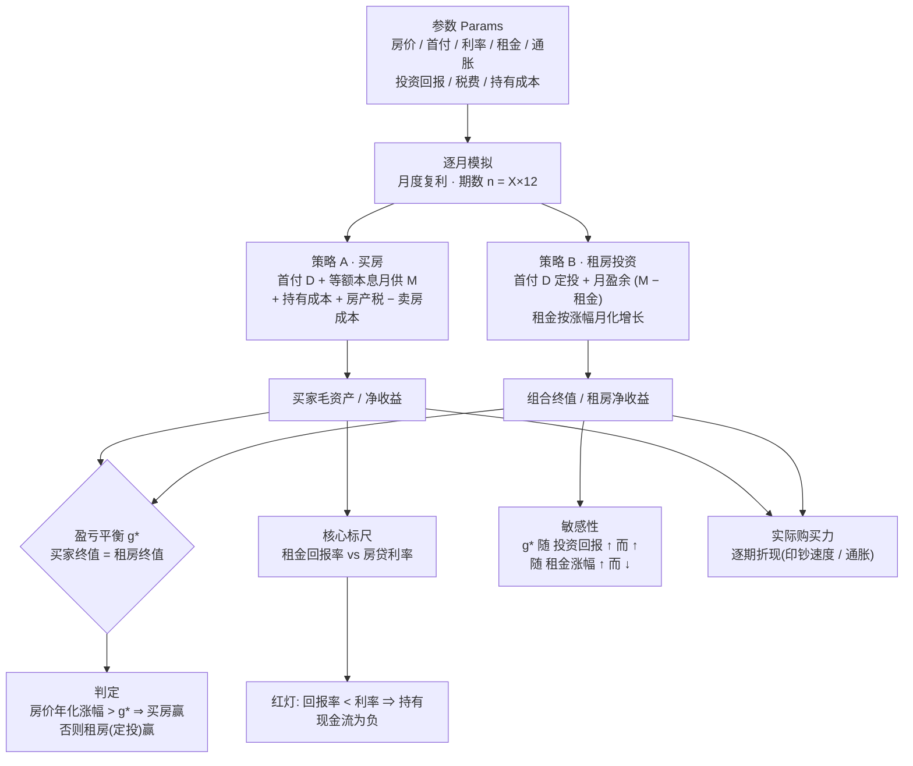
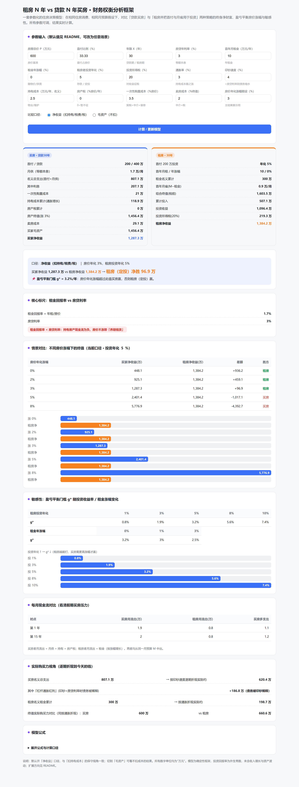

# 租房 vs 买房 · 财务权衡分析框架

[](https://github.com/ZoranAop/rent-vs-buy-framework/actions/workflows/ci.yml)
[](LICENSE)
[](rent_vs_buy_model.py)

一套**参数化、可复用**的住房决策财务模型。它在统一假设下对比两种终身住房策略，输出终身净财富、盈亏平衡房价涨幅、敏感性、实际购买力与月度现金流压力，帮助你把"买房还是租房"从直觉判断变成可计算的权衡。

- **策略 A · 贷款买房**：首付 + 等额本息按揭，持有 X 年。
- **策略 B · 租房投资**：租同等品质住房，把首付与每月"月供 − 租金"的盈余用于投资，持有 X 年。

所有现金流按**月度、月度复利**模拟；所有外生变量（房价、利率、租金、通胀、投资回报、税收、持有成本）都是可调参数。

## 框架总览（数据流）



> 同一组输入同时驱动"胜负判定"与"盈亏平衡门槛 g\*"，因此两者口径一致、不会自相矛盾。

## 交互预览



> 直接打开 [`index.html`](index.html) 即可使用（零安装，改参数实时出结果）。上方截图为默认参数（苏州 600 万、首付 30%、30 年、利率 3%、投资年化 5%）的完整渲染。

---

## 1. 解决的问题

给定一组市场与个人参数，回答：

1. 在 X 年后，**哪种策略留下的净财富更高**？
2. 房价每年要涨多少，**买房才不输给租房定投**？（盈亏平衡门槛 `g*`）
3. 当前市场的**租金回报率是否覆盖房贷利率**？（持有房产现金流是否为正的核心标尺）
4. 结论对**投资收益率、租金涨幅**有多敏感？
5. 考虑通胀后，**实际购买力**如何？前期**每月现金流压力**谁更大？

---

## 2. 核心假设（显式、可覆盖）

| # | 假设 | 说明 |
|---|------|------|
| 1 | 两种策略消费**相同品质**的住房 | 公平比较的前提 |
| 2 | 双方初始拥有相同规模资本 `D`（= 首付金额） | 买房者把 `D` 变成房产权益；租房者把 `D` 拿去投资 |
| 3 | 双方承诺**相同的月住房预算** = 买房者月供 `M` | 租房者把盈余 `(M − 租金)` 全部投资 |
| 4 | 投资回报、通胀、印钞速度、租金、税率、持有成本均为**外生常数** | 确定性核心；随机性作为扩展点（见 §7） |
| 5 | 投资所得税仅对**收益部分**征收 | `税 = max(0, 组合 − 累计投入) × 税率` |

> 假设 3 是框架的关键简化：它把问题收敛为"同一笔月预算，究竟该换成房产权益还是金融组合"。若你的真实月预算不同，直接改 `rent0` / `invest_return` 等参数即可。

---

## 3. 参数表（默认值）

单位：金额一律为**万元**，利率一律为**百分数**（3.0 = 3%）。

| 参数 | 含义 | 默认 |
|------|------|------|
| `price` | 房屋总价 P | 600 |
| `down_pct` | 首付比例 | 30 |
| `years` | 年限 X（贷款期/租房期） | 30 |
| `loan_rate` | 房贷年利率 | 3.0 |
| `rent0` | 首年月租金（年付） | 10 |
| `rent_growth` | 租金年涨幅 | 0.0 |
| `invest_return` | 租房者投资年化 | 5.0 |
| `invest_tax` | 投资所得税（对收益） | 20.0 |
| `inflation` | 通胀率 | 3.0 |
| `print_speed` | 印钞速度 | 4.0 |
| `holding_cost` | 持有成本（万/年，名义） | 2.5 |
| `property_tax` | 房产税（%房价/年） | 0.0 |
| `buy_cost_pct` | 一次性购置成本（%房价） | 3.5 |
| `sell_cost_pct` | 卖房成本（%终值） | 2.0 |
| `house_growth` | 房价年化涨幅（展示用） | 3.0 |

---

## 4. 数学模型

### 4.1 买房方案
```
首付 D = P × down_pct
贷款 L = P − D
月利率 mr = loan_rate / 12，期数 n = X × 12
月供 M = L·mr·(1+mr)^n / ((1+mr)^n − 1)          （mr=0 时 M = L/n）
一次性购置成本 = P × buy_cost_pct
持有成本（名义）逐年按通胀增长；房产税 = property_tax% × 当年房价 / 年
卖房成本 = 房产终值 × sell_cost_pct
房产终值 = P × (1 + house_growth)^X
买家毛资产 = 房产终值
买家净收益 = 房产终值 − 购置 − Σ持有 − Σ房产税 − 卖房成本
```

### 4.2 租房方案
```
组合期初 = D
每月：组合 = 组合 × (1 + invest_return/12) + (M − 当月租金)
租金按 rent_growth 月化增长：月化因子 = (1+rent_growth)^(1/12) − 1
组合终值(税前) = 组合期末
投资税 = max(0, 组合 − 累计投入) × invest_tax%
租房净收益 = 组合终值 − 投资税
```

### 4.3 盈亏平衡门槛 `g*`
按所选口径求 `g*` 使买卖双方终值相等：
- **净收益口径**：`买家净收益(g*) = 租房净收益`
- **毛资产口径**：`P × (1+g*)^X = 组合终值`

判定：**房价年化涨幅 > g\* ⇒ 买房赢；< g\* ⇒ 租房（定投）赢。**

### 4.4 实际购买力（逐期折现）
```
买房实际支出 = D + Σ_t (M + 持有_t + 房产税_t) / (1+print_speed)^(t/12)
租房实际支出 = Σ_t 租金_t / (1+inflation)^(t/12)
终值实际购买力 = 资产 / (1+inflation)^X          （双方同分母对比）
```
买房用「印钞速度」作折现率以体现债务稀释；终值对比统一用「通胀率」保证同口径。

---

## 5. 关键指标与判读

- **`g*`（盈亏平衡门槛）**：框架的主输出。它把"未来房价能不能涨、能涨多少"压缩成一个可比阈值。任何房价涨幅假设只要和 `g*` 比大小即可下结论。
- **租金回报率 vs 房贷利率**（核心标尺）：`rent_yield = rent0 / P`。
  - `rent_yield ≥ loan_rate` → 持有房产现金流为正，房价不涨也划算；
  - `rent_yield < loan_rate` → 持有即"养赔钱货"，房价不涨则买房必输。
- **敏感性**：`g*` 随 `invest_return` 上升而**上升**（租房越能打，买房需更高涨幅才赢），随 `rent_growth` 上升而**下降**（租金越涨，租房月盈余被侵蚀、越被动）。见下方速查表。
- **月度现金流**：买房者前期月流出（月供+持有+税）显著高于租房者，体现"前期压力"；这是框架用净财富比较时容易被忽略的体感成本。

### g* 敏感性速查表（口径：净收益 / 毛资产，其余取 §3 默认）

**表 1 · 随投资年化回报 `invest_return` 变化（`rent_growth = 0`）**

| 投资年化 | 净收益口径 `g*` | 毛资产口径 `g*` |
|---|---|---|
| 1% | 0.826% | 0.196% |
| 3% | 1.900% | 1.678% |
| **5%（默认）** | **3.196%** | **3.290%** |
| 8% | 5.506% | 5.916% |
| 10% | 7.246% | 7.787% |

**表 2 · 随租金年涨幅 `rent_growth` 变化（`invest_return = 5`）**

| 租金年涨幅 | 净收益口径 `g*` | 毛资产口径 `g*` |
|---|---|---|
| **0%（默认）** | **3.196%** | **3.290%** |
| 1% | 3.013% | 3.099% |
| 3% | 2.489% | 2.552% |

> 读表：投资回报越高 → 租房组合越强 → 买房需要**更高**涨幅（`g*` 上升）；租金涨得越快 → 租房月盈余被侵蚀 → 买房**更易**赢（`g*` 下降）。

---

## 6. 使用方法

### 6.0 安装（可选）

```bash
# 安装为可编辑包（推荐，方便本地修改后直接测试）
pip install -e .

# 安装开发依赖（运行测试）
pip install -e ".[dev]"
```

> 无需安装也可直接运行：`python rent_vs_buy_model.py`（纯标准库，无第三方依赖）。

### 6.1 交互式（零安装）
直接用浏览器打开 [`index.html`](index.html)，改参数即可实时看结果。无需任何依赖。

### 6.2 命令行 / 批量（Python）
```bash
# 默认场景（净收益口径）
python rent_vs_buy_model.py --basis net

# 毛资产口径
python rent_vs_buy_model.py --basis gross

# 覆盖任意参数
python rent_vs_buy_model.py --price 800 --down_pct 40 --invest_return 8 --property_tax 1.5

# 从 JSON 配置文件加载
python rent_vs_buy_model.py --config my_scenario.json
```
`my_scenario.json` 例：
```json
{"price": 800, "down_pct": 40, "years": 25, "invest_return": 7, "property_tax": 1.2}
```

作为库调用：
```python
from rent_vs_buy_model import Params, simulate, break_even, report

p = Params(price=800, invest_return=7.0, property_tax=1.0)
r = simulate(p, house_g=3.0)
g = break_even(p, basis="net")
print(report(p, basis="net"))
```

---

## 7. 默认场景示例

参数取 §3 默认值、年限 30 年、房价年化 3%：

**净收益口径**（扣除购置/持有/房产税/卖房成本/投资税）

| 指标 | 买房 | 租房 |
|------|------|------|
| 月供 | 1.7707 万/月 | — |
| 房产终值 / 组合终值(税前) | 1456.4 万 | 1584.4 万 |
| 买家净收益 / 租房净收益 | **1287.3 万** | **1371.0 万** |
| 盈亏平衡门槛 `g*` | — | **3.196 %/年** |
| 租金回报率 / 房贷利率 | 1.667% / 3.000% | （红灯：持有现金流为负） |

结论：**租房（定投）净胜约 83.7 万**；房价年化需超过 **3.196%** 买房才不输。

**毛资产口径**（不扣成本）门槛 `g* = 3.331 %/年`，与"不扣税/费"的简化口径一致。

> 完整输出见 [`examples/default_scenario.md`](examples/default_scenario.md)。

---

## 8. 局限与扩展方向

框架为**确定性核心**，以下为有意留出的扩展点（非缺陷）：

1. **投资回报为常数、无波动** → 可改为蒙特卡洛模拟，加入收益率分布与"时点风险（sequence risk）"。
2. **无收入增长** → 可加入收入/预算随时间的增长曲线，影响月盈余与通胀优势。
3. **持有成本为固定名义基准、仅随通胀增长** → 可替换为维修周期、装修重置等更细的现金流。
4. **房产交易税简化** → 可区分契税、增值税（满五唯一豁免）、中介阶梯费率。
5. **单城单房** → 可扩展为多城市/多标的组合比较。
6. **未含居住确定性、学区、流动性溢价等定性收益** → 这些是非财务变量，框架给出数字后由决策者自行加权。

---

## 9. 许可证

[MIT](LICENSE)
